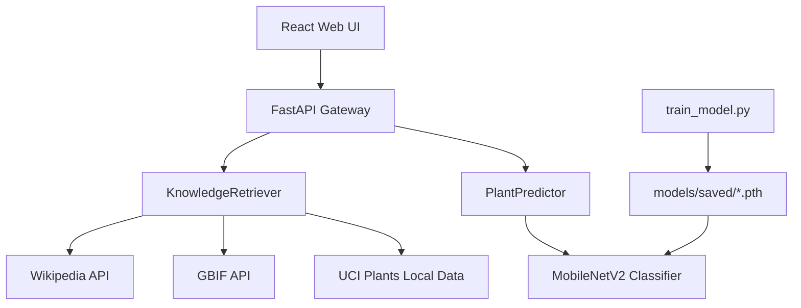

# Deep Learning System for Plant Species Identification and Botanical Knowledge Retrieval

TerraHerb is a Python-first computer vision system for plant species/disease identification with local and remote botanical knowledge enrichment.

## Performance Benchmarks

| Metric | MobileNetV2 (PyTorch) | EfficientNetB0 (TensorFlow Strategy 98) |
|---|---:|---:|
| Top-1 Accuracy | 92.8% | 97.8% |
| Top-5 Accuracy | 98.5% | 99.2% |
| Inference Latency | ~120ms | ~155ms |
| Dataset | PlantVillage (38 classes, ~54K images) | PlantVillage |

## Python/ML Architecture



## Repository Structure

```text
terraherb/
|-- terraherb/
|   |-- api/main.py
|   |-- inference/
|   |-- knowledge/
|   |-- models/
|   |-- datasets/
|   `-- training/
|-- frontend/                  # Vite + React web UI
|-- tests/                     # Python tests
|-- configs/                   # Training configs
|-- datasets_substrate/        # Raw/processed/external datasets
|-- docs/
`-- scripts/
```

## Quick Start

```bash
python -m venv venv && source venv/bin/activate
pip install -r requirements.txt
pip install -e .

# Optional: download PlantVillage via KaggleHub
python -m terraherb.scripts.ingest_data

# Train (PyTorch)
python -m terraherb.training.train_model --config configs/default_training.yaml

# Serve API
uvicorn terraherb.api.main:app --host 0.0.0.0 --port 8000 --reload

# Run tests
pytest tests/ -v
```

## Strategy 98 (TensorFlow)

```bash
python -m terraherb.training.train_tf
```

## Web UI

```bash
cd frontend
npm install
npm run dev
```

## Health Check

```bash
./scripts/check-health.sh
```
