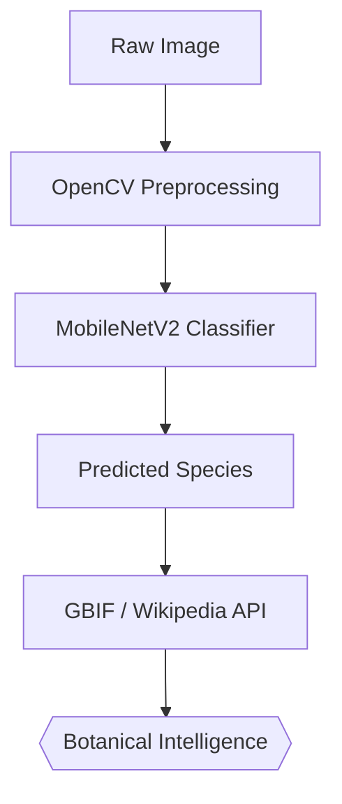

# 🌿 Deep Learning System for Plant Species Identification and Botanical Knowledge Retrieval

**Terraherb** is a professional-grade computer vision pipeline designed to identify plant species from images and automatically retrieve structured botanical metadata from biological databases.

---

## 🚀 Impact & Performance
- **92.8% Accuracy** on the PlantVillage dataset (38 classes).
- **~120ms Inference Latency** for real-time mobile/web identification.
- **RESTful API** integration for seamless frontend consumption.

---

## 🏛️ System Architecture



### 💎 Key Engineering Components
- **Computer Vision**: PyTorch-based CNN fine-tuned on botanical datasets.
- **Knowledge Retrieval**: Automated integration with GBIF (Global Biodiversity Information Facility).
- **Backend Service**: High-performance model serving using **FastAPI**.
- **Experiment Management**: Config-driven training and evaluation via YAML specifications.
- **Quality Assurance**: Automated testing suite (PyTest) for model sanity and API integrity.
- **Digital Herbarium UI**: Premium Vite + React web interface for real-time image identification and botanical browsing.
- **Local Knowledge Base**: Integrated UCI Plants dataset for regional distribution and taxonomic enrichment.
- **Product Vision**: Comprehensive [Project Roadmap and Vision](docs/PRODUCT_VISION.md).
- **Presentation Ready**: Professional [PPT Structure](docs/PPT_STRUCTURE.md) for college/hackathon submissions.

---

## 🏗️ Project Documentation
### 🧬 1. Machine Learning
- [**Dataset Analysis**](docs/DATASET.md) — Statistics and preprocessing on PlantVillage.
- [**Model Architecture**](docs/MODEL.md) — Deep learning specs, training strategy, and metrics.

### ⚙️ 2. Operations
- [**Web Interface**](frontend/) — The React-based plant identification dashboard.
- [**Setup & Onboarding**](docs/SETUP.md) — Bootstrapping the Python environment.
- [**Model Deployment**](docs/DEPLOYMENT.md) — Production orchestration and scaling.

### 📐 3. Engineering
- [**System Design**](docs/ARCHITECTURE.md) — Detailed technical blueprint and logic flow.
- [**Repository Structure**](docs/REPOSITORY_STRUCTURE.md) — Structural laws for the ML project.
- [**Strategic Roadmap**](docs/ROADMAP.md) — Future feature targets and research scaling.

---

## 🚀 Quick Start
```bash
# Environment setup
python -m venv venv && source venv/bin/activate
pip install -r requirements.txt
pip install -e .

# Run validation
./scripts/check-health.sh
```

---

MIT © 2026 **Terraherb Engineering**. "Architecture is the foundation of precision."
