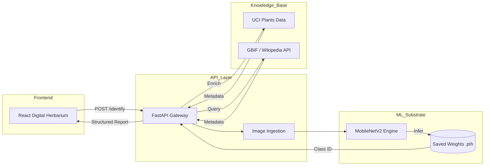

# 🧬 Architectural Blueprint — Internal Logic

This document provides a deep-dive into the technical execution and sequence flow of the **Terraherb** AI substrate.

## 🏛️ System Topology

## 🔄 Interaction Sequence
1. **User Upload**: A raw image is submitted to the `/identify` endpoint.
2. **Preprocessing**: The image is resized to 224x224 and normalized using ImageNet statistics.
3. **Neural Inference**: The PyTorch model performs a forward pass to determine species/health class.
4. **Knowledge Retrieval**: The system queries the local UCI dataset and remote biological APIs.
5. **Response Synthesis**: Classification results and botanical metadata are merged into a single JSON response.

---
*Derived by AI. Built for Humanity.*
