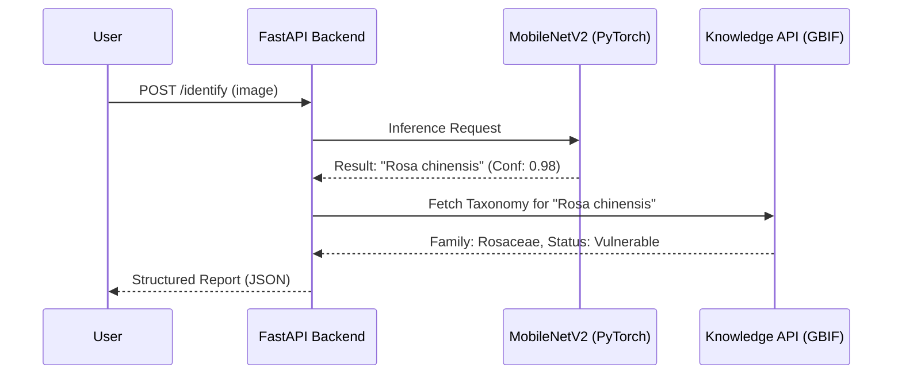

# 🏛️ ARCHITECTURE.md — System Blueprint

Terraherb is a **modular computer vision system** optimized for species identification and metadata enrichment.

## 🏗️ Pipeline Overview
The system operates as a sequential data pipeline:
1. **Preprocessing Layer**: OpenCV routines for resizing, normalization, and noise reduction.
2. **Inference Layer**: MobileNetV2 CNN (PyTorch) for high-probability species classification.
3. **Retrieval Layer**: Asynchronous queries to GBIF and Wikipedia for taxonomic and medicinal data.
4. **Service Layer**: FastAPI REST endpoints for external system interaction.

## 🧩 Directory Responsibilities
| Path | Ownership | Responsibility |
| :--- | :--- | :--- |
| `terraherb/api/` | Systems Eng | FastAPI service and REST interfaces. |
| `terraherb/models/` | ML Eng | Model architecture and weight management. |
| `terraherb/training/` | ML Eng | Training loops, loss functions, and optimization. |
| `terraherb/knowledge/` | Data Eng | Biological API clients and data parsers. |
| `terraherb/datasets/` | Data Eng | PyTorch data loaders and augmentation logic. |

## 🔄 Sequence Flow

---
*Precision. Performance. Provenance.*
