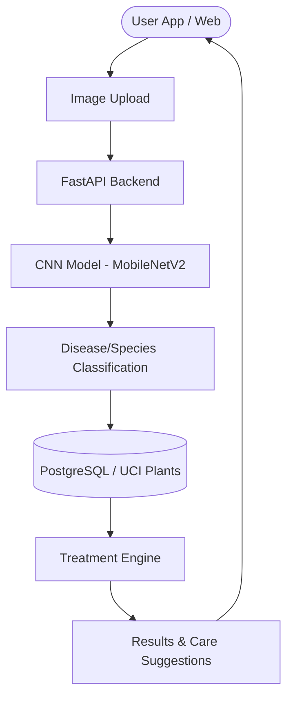

# 🌱 TerraHerb – AI Powered Smart Plant Care System

## 1️⃣ Project Overview
**TerraHerb** is a smart plant monitoring and disease detection system that helps users grow healthier plants using **AI, image recognition, and environmental analysis**.

### Core Capabilities:
- **Disease Identification**: High-accuracy CNN-based analysis of leaf health.
- **Treatment Intelligence**: Automated suggestions for organic and chemical remedies.
- **Botanical Registry**: Species identification and taxonomic metadata retrieval.
- **Care Reminders**: Structured schedules for watering, nutrients, and sunlight.

---

## 2️⃣ Problem Statement
- **Early Detection**: Failure to identify diseases leads to irreversible crop/plant loss.
- **Knowledge Gap**: Lack of precise watering/sunlight requirements for specific species.
- **Maintenance Fatigue**: Difficulty in tracking multi-plant growth cycles and history.

---

## 3️⃣ The Terraherb Solution
A unified AI-driven substrate that provides:
1. **Visual Diagnostics**: Upload a photo → Detect disease → Confidence score.
2. **Actionable Recommendations**: Treatment, prevention, and specific care instructions.
3. **Growth Monitoring**: Historical tracking of plant health and recovery progress.

---

## 4️⃣ Key Features
- **🌿 Plant Disease Detection**: Real-time CNN analysis with confidence metrics.
- **💊 Treatment Engine**: Curated database of organic and chemical solutions.
- **📊 Health Tracker**: Longitudinal tracking of watering, growth, and disease logs.
- **⏰ Smart Reminders**: Context-aware alerts for plant maintenance.
- **📚 Knowledge Base**: Searchable registry of ideal temperature, soil, and light needs.
- **📸 Species Identification**: Scientific and common name classification via GBIF.

---

## 5️⃣ System Architecture

---

## ⚖️ Strategic Impact
Terraherb is designed for **home gardeners, professional farmers, and environmental conservationists**, providing a technically robust solution to the universal challenge of plant health management.
